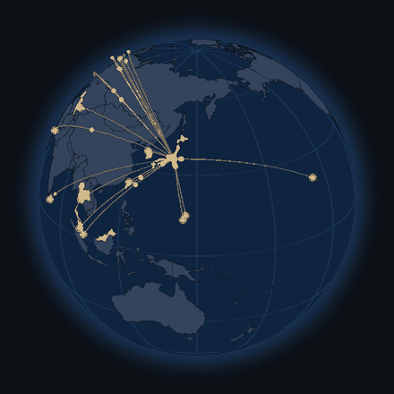

<h1 align="center">Kaito Kobayashi</h1>

  Software Engineer · CS undergrad at Waseda University

  

---

### 👋 About

- 🎓 B.S. student (3rd Year) in Computer Science and Engineering, **Waseda University**
- 🏫 **Executive Member, Engineering** at Nagase (Toshin) — designing, building, operating the educational platform system
- 🎹 Away from one keyboard, I play the piano
- ✈️ Traveling around the world

### 💼 Experience

| When | Where | What |
| --- | --- | --- |
| 2026.08 – | **Mercari (Merpay)** | Software Engineer Intern — Payment Platform |
| 2026.06 | **CyberAgent** | CA Tech Job — ABEMA Monetize Platform ([blog](https://developers.cyberagent.co.jp/blog/archives/64534/)) |
| 2026.03 | **Sansan** | Software Engineer Intern — Sansan Data Hub |
| 2025.06 – 2025.10 | **Euxir** | Freelance Software Engineer (Go / MySQL) |
| 2025.01 – | **Nagase (Toshin)** | Software Engineer → Project Lead → Executive Member, Engineering |

### 🛠 Tech Stack

  
   
  
  

### ✈️ Places I've Been

  
   
  🖱️ <a href="https://kobakaito.github.io/">Open the interactive globe</a> — drag to spin, click a place to fly there

  <b>20 destinations from Tokyo</b> 
  🇰🇷 Korea · 🇹🇼 Taiwan · 🇹🇭 Thailand · 🇲🇾 Malaysia · 🇸🇬 Singapore · 🇱🇰 Sri Lanka · 🇺🇿 Uzbekistan 
  🇦🇪 UAE · 🇹🇷 Türkiye · 🇬🇷 Greece · 🇮🇹 Italy · 🇻🇦 Vatican City · 🇦🇹 Austria · 🇭🇺 Hungary 
  🇨🇿 Czechia · 🇵🇱 Poland · 🇩🇪 Germany · 🌺 Hawaii · 🇬🇺 Guam · 🇲🇵 Saipan

